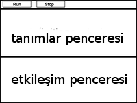

Ünite 1 Bilgisayar oyunları ve Koordinat düzlemleri
===================================================
Öğrenciler en sevdikleri bilgisayar oyunlarının bileşenlerini tartışırlar, ve bunların bir dizi koordinata indirgenebileceğini keşfederler. Daha sonra Kartezyen uzayındaki koordinatları incelerler, ve bilgisayar oyunundaki karakterlerin zamanın değişik anlarındaki koordinatlarını belirlerler. Koordinatlarla rahat çalışır hale geldikten sonra, kendi bilgisayar oyunları hakkında beyin fırtınası yaparlar ve kendi oyunları için zamanın değişik anlarına karşılık gelen örnek koordinat listeleri yaparlar.

Giriş (Süre: 5 dakika)
-----------------------
Önyükleme'ye hoşgeldiniz! Bu derste yeni bir programlama dili, yani bilgisayarlara onlardan ne yapmasını istediğinizi tam olarak söylemenin bir yolunu öğreneceksiniz. Aynı Türkçe veya İngilizce gibi, bir programlama dilinin de öğrenmeniz gereken bir sözcük dağarcığı ve grameri vardır. Neyse ki burada öğreneceğiniz dilin zaten bildiğiniz basit matematikle birçok ortak noktası bulunuyor!

Demoyu ayrıştıma (Süre: 10 dakika)
-----------------------------------
Basit bir video oyununu keşfederek başlayalım ve sonrasında da nasıl çalıştığını anlayalım. Oyunu oynamak için `bu linki <http://www.wescheme.org/view?publicId=LyMwExWayT>`_ tıklayın, ve bir iki dakika boyunca oyunu keşfedin. Kediyi sola sağa hareket ettirmek, sıçrayıp yakutu yakalamak, ve köpekten kaçınmak için ok tuşlarını kullanın!

Bu oyun karakterlerden oluşuyor, ve herbirinin kendine özgü bir davranışı var. Yakut sağdan sola hareket ediyor, köpek te öyle. NinjaKedi sadece siz tuşlara basınca hareket ediyor, ve sola sağa yukarı ve aşağı gidebiliyor. Oyunun nasıl anladığını önce karakterlerin nasıl çalıştıklarını anlayarak çözebiliriz.

.. image:: images/unite1_tablo1.png
    :align: right
    :class: imgright
    
İş defterinizin 2. sayfasına gidin. Orada NinjaKedi oyununu tersine mühendislik yaparak nasıl çalıştığını anlamak için kullanacağımız bir tablo bulacaksınız. O tablonun ilk sütununu oyunda geçen şeylerin bir listesi ile doldurun.

.. class:: teacher-note

Bu bir takım çalışması da olabilir. Öğrencilerden birkaçını yaptıklarını seçip paylaşın ki herkes bu alıştırmada neyin listelendiğini anlasın: "kedi" gibi isimler listelenecek ama "atlama" gibi eylemler listelenmeyecek.

.. class:: clearpar

Bütün hareketli karakterleri listelediniz mi? Oyunda başka ne var? Arkaplan oyunun bir parçası mı? Peki ya puan göstergesi?

.. image:: images/unite1_tablo2.png
    :align: right
    
Burada ayrıca oyunu ornarken nelerin değiştiğini düşünmemiz lazım. Örneğin yakut? Büyüyor mu? Rengi değişiyor mu? Dönüyor mu? Yakut'un değişen tek şeyi pozisyonu! Diğer herşeyi aynı kalıyor. Peki ya köpek? Kedi? Bu soruları düşünerek ikinci sütunu doldurun, her karakter hakkında değişen her unsuru listeleyin.

Köpek, Yakut, Bulut, ve Kedi'nin sadece yer değiştirdiğini, ve başka hiçbir şeyin değişmediğini farkettiniz mi? Peki ya arkaplan - o hiç değişmiyor, o yüzden tabloda onunla ilgili satırı boş bırakabiliriz! Puan değişimi göstergesine dikkat ettiniz mi? Onu da tablonuza eklemelisiniz!

Koordinat Düzlemleri (Süre: 15 dakika)
--------------------------------------
.. image:: images/unite1_kd1.png
    :align: right

Bilgisayarlar bir oyun karakterinin ekrandaki yerini temsil etmek için sayıları kullanır, üzerinde sayılar olan bir cetvel gibi olan ölçek çizgileri ekranın sol-alt köşesine olan uzaklığı ölçmek için kullanılırlar. Biz kendi video oyunumuzda ölçek çizgilerini ekranın solda 0 pozisyonundan sağda 640 pozisyonuna kadar olacak şekilde yerleştireceğiz. Köpek resmini alıp ölçek çizgisinde herhangi bir yere yerleştirebiliriz, ve ölçek çizgisinin sol kenarından olan uzaklığını ölçeriz. Bu ölçümü bilen birisi, sadece bu sayıyı kullanarak köpeği aynı şekilde aynı yere yerleştirebilecektir. Ekranın sağındaki köpeğin koordinatı nedir? Peki ya merkezdekinin? Koordinat ne olursa köpek ekranın sol sınırından dışarı çıkar?

.. class:: teacher-note

Burada öğrenciler için anahtar nokta kesinlik ve nesnelliktir. Birden fazla doğru cevap var, ama öğrenciler herhangi bir çözümün niye kesin ve net olması gerektiğini anlamalılar. Bu da öğrencilerin ortak bir "sıfır" noktasını (ölçek çizgisinin başlangıç çizgisi) ve yönü (sağ sol gibi, karakterin posizyonunun ölçüldüğü kenar) paylaşan çözümler üretmesini gerektirir.

.. image:: images/unite1_kd2.png
    :align: right

İkinci bir ölçek çizgisi ekleyerek bir oyun karakterini iki boyutlu ekranın her iki boyutunda istediğimiz bir yere yerleştirebiliriz. Birinci çizgiye x-eskeni deriz ve soldan sağa uzanır. Aşağıdan yukarıya uzanan ikinci ölçek çizgisine ise y-ekseni denir. 2-boyutlu bir koordinat hem x- hem de y-ekseni üzerindeki yerlerden oluşur. Mesela NinjaKedi'in ekrandaki pozisyonunu belirlemeye çalışalım. x-koordinatını bulmak için NinjaKedi'ten aşağıya bir çizgi çeker ve bu çizginin x-eksenini kestiği yerdeki sayıyı okuruz. y-koordinatı da y-eksenine yatay bir çizgi çekerek bulunur.

.. class:: teacher-note

Bir koordinat tek bir noktayı temsil eder, ama bir resim (tanımı gereği) birçok noktadan oluşur. Bazı öğrenciler bir oyun karakterinin koordinatının onun resminin merkezine mi yoksa köşelerinden birine mi denk geldiğini soracaklardır. Bu elimizdeki programda koordinat resmin merkezine denk düşmektedir - ama başka programlarda farklı olabilir. Öğrencilerle bu konuyu tartışırken önemli olan burada bir esneklik olduğunun ve bu esneklik dahilinde tutarlı olunduğu sürece sorun olmadığınınanlatılmasıdır.

Bu koordinatları yazarken her zaman x koordinatını y'den önce yazarız (aynı bu harflerin alfabedeki sıraları gibi). Çoğu zaman (200,50) şeklinde yazılmış koordinatlar görürsünüz, bunun anlamı x-koordinatının 200 ve y-koordinatının da 50 olduğudur.

Bir oyun karakterinin nasıl hareket ettiğine bağlı olarak posizyonu sadece x ekseninde, sadece y ekseninde, veya ikisinde birden değişebilir. İş kitabınızda doldurduğunuz tabloya bakın (Sayfa 2). NinjaKedi yukarı ve aşağı hareket ediyor mu? Eğer öyleyse değişen nedir: x koordinatı mı, y koordinatı mı, yoksa ikisi birden mi? Peki bulutlar nasıl hareket ediyor? Yukarı aşağı mı? Sola veya sağa mı? İkisi birden mi?

.. image:: images/unite1_tablo3.png
    :align: right

Tablonun kalanını da doldurun, ve her oyun karakteri için değişenin ne olduğunu belirleyin.

Oyun planlama iş kitabının 3. sayfasına dönün, ve NinjaKedi oyununun resminin bulunduğu proje sayfasına bakın. Ekranın sol-alt köşesinin koordinatları nedir? Sağ-üst koşeninki nedir? Merkezinki? Pratik yapmak için her kenarın orta noktasını koordinatlarını yazarak etiketleyin, sonra da her karakterin yanına koordinatlarını yazın.

Beyin fırtınası (Süre: 15 dakika)
---------------------------------
Sayfa 4'te, kendi oyununuzu yapmak için bir planlama şablonu bulacaksınız. Aynı NinjaKedi oyununda herşeyin listesini yaptığımız gibi, burada da oyunda olacak herşeyin bir listesi ile başlayacağız.

Oyununuzla işe başlamak için oyunda dört şey olmalı:

* Bir arkaplan resmi, mesela bir orman, bir şehir, uzay, vs.
* Kullanıcı tuşlara bastığı zaman hareket edecek bir oyuncu karakteri.
* Sağdan sola doğru hareket eden ve oyuncu onu yakaladığı zaman puan toplayacağı bir hedef nesnesi.
* Sağdan sola doğru hareket eden ve oyuncunun kaçınması gereken bir tehlike nesnesi.

Şimdi yaratıcı olma zamanı! İş kitabında Sayfa 4'ü kendi oyununuz için doldurun, kendi oyuncu, hedef ve tehlike seçiminizi kullanın

İşlemlerin Sırası (Süre: 20 dakika)
-------------------------------------
Matematik aynı Türkçe, İngilizce, veya diğerleri gibi bir dildir. Fiziksel nesneleri tarif etmek için "ekmek", "domates", "ketçap", "peynir" gibi isimler kullanırız. Matematik ise 1, 2 or 3 sayıları gibi değerler kullanır. İnsanlar ayrıca nesnelerle ilgili yapılan işleri anlatmak için "dilimlemek", "doğramak", "dökmek", "eritmek" gibi yüklemler kullanır. Matematikte ise toplama, çıkartma gibi sayılara uygulanan fonksiyonlar vardır. Aynı "bir ekmeği dilimlemek" gibi "dört ile beşi topla" deriz.

.. class:: teacher-note

Öğrenciler matematiğe bir dil gözüyle bakmalıdırlar. Onlara bu konuda yardımcı olmak için matematiğin sözdizimini ve gramerin, tartışabilirsiniz, ve eğer işlemlerin sırası belli olmazsa nasıl belirsizlikle ilgili sıkıntılar ortaya çıkabileceğine işaret edebilirsiniz. Öğrencilere matematiğin insanların hesaplamaları biribirlerine anlatmaları için bir dil olduğunu görmeleri için yardım etmelisiniz.

Bir matematiksel ifade bir cümle gibidir: bir işlem yapmak için yönergeler verir. 4+5 ifadesi bize 4 ile 5'i toplamamızı söyler. Bir ifadeyi **değerlendirmek** için ifadedeki yönergeleri takip ederiz. 4+5 ifadesi 9 değerine karşılık gelir, biz bu duruma "4+5 ifadesi 9'a **değerlenir**" diyeceğiz.

    8∗4 kaça değerlenir? 
    20−16 kaça değerlenir? 
    16−20 kaça değerlenir?

Bazen bir görevi tamamlamak için birden fazla ifade gerekir. Bir sandviç yapmak için gerekli yönergeleri yazsaydınız hangisinin önce geldiği çok önemli olurdu: peyniri doğramak, ekmeği dilimlemek, ketçabı dökmek, vs. Matematikte de fonksiyonların sırası önemlidir. Eğer birisi "dört artı iki eksi bir" derse bu birden fazla anlama gelebilir:

* Dört ile ikiyi ekle, sonra bir çıkart: :math:`(4+2)−1`
* İkiden bir çıkart, sonuca dört ekle: :math:`4+(2−1)`

Siz de böyle birden fazla anlama gelebilecek bir ifade yazın.

Bir ifadeyi nasıl okuduğunuza bağlı olarak çok farklı sonuçları olabilir. Bu bir sorundur çünkü sık sık matematik kullanarak hesaplamaları birbirimize anlatırız. Örneğin cep telefonu şirketinizle ilk baştan aramalara ve mesajlara hangi tarifeden para ödeyeceğiniz konusunda anlaşmanız gerekir. Arama ve mesaj tarifesi için söylediğiniz sayılar yer değiştirirse faturanız yanlış olacaktır. Bu tür sorunlardan kaçınmak için bir ifadedeki işlemlerin hangi sırada yapılacağı üzerine fikir birliği içerisinde olmamız gerekir. Bu iki şekilde yapılabilir:

#. Sıralama üzerine oturup anlaşabiliriz
#. İfadelerimize işlem sıralamasını da belirten detaylar ekleyebiliriz

İşlemlerin neden bir sırası olması gerektiğine dair bir sebep söyleyiniz.

.. image:: images/unite1_pyramid.png
    :align: right

Matematikçiler her zaman işlemlerin sırasına dair fikir birliğinde değildiler, ama artık ifadelerin nasıl değerlendirileceğine dair bir dizi kuralımız var. Sağdaki piramit bu sıralamayı özetliyor. Bir ifadeyi değerlendirirken önce piramidin üst kısmındaki işlemleri yaparız (çarpma ve bölme). Ancak onları tamamladıktan sonra piramitte bir alttaki seviyeye geçeriz. Eğer her iki işlem de varsa:(örneğin :math:`4+2−1`), o zaman ifadeyi soldan başlayarak sağa doğru okuruz, ve bu sıralamayla ortaya çıkan işlemleri uygularız.

Örnek olarak: :math:`19÷2∗11−7+8`  ifadesinde fonksiyonları hangi sırada uygulamak gerekir? 

#.        :math:`+÷∗−`
#.        :math:`÷∗−+`
#.        :math:`÷∗+−`
#.        :math:`∗÷+−`

.. image:: images/unite1_dc1.png
    :align: right

Bir ifadedeki işlemlerin sırasını belirtmenin bir yolu da ifadeyi diyagram olarak çizmektir. Bu diyagrama **Değerlendirme Çemberi** denilir. Burada Değerlendirme Çemberi'nin 4−5 ifadesine karşılık gelen bir örneğini görebilirsiniz Değerlendirme Çemberleri bir ifadenin içindeki işlemlerin yapısını anlatır. Tüm Değerlendirme Çemberleri'nin iki kuralı vardır:

**Çember Kuralı 1: Her çemberde bir fonksiyon olmalıdır, ve bu fonksiyon çemberin üst kısmına yazılır.**

**Çember Kuralı 2: Sayılar aşağıya yazılır, ve soldan sağa dizilir.**

.. image:: images/unite1_dc2.png
    :align: right
    :class: clearpar

Sağda verilen değerlendirme çemberi hangi kuralı ihlal ediyor?

.. class:: clearpar

Aşağıdaki ifadelerin herbiri için bir Değerlendirme Çemberi çizin:

#.        :math:`6∗4`
#.        :math:`7−10`
#.        :math:`5+8`
#.        :math:`\frac{351}{-1}`

.. image:: images/unite1_dc3.png
    :align: right

Her Değerlendirme Çemberi karşılığı olan aritmetik ifadenin sonucuna **değerlenir**. Örneğin sağdaki çember −1 değerine karşılık gelir, çünkü çember çıkartma işlemini (en tepede) verilen sayılara dizildikleri sırada uygulamamızı söylüyor: :math:`(4−5)`.

.. image:: images/unite1_dc4.png
    :align: right
    :class: clearpar
    
Bir ifadede birden fazla fonksiyon kullanmak için Değerlendirme Çemberlerini birleştirebiliriz. Şu ifade için yazdığınız Değerlendirme Çemberine bakın: :math:`\frac{351}{-1}`. Zaten gördük ki :math:`4-5` ifadesi için olan çember -1 değerine karşılık gelir, bu yüzden -1 sayısının yerine :math:`4-5` koyabiliriz. Bu ifadenin hangi değere sahip olduğunu değiştirir mi?

.. class:: clearpar

Verilen Değerlendirme Çemberini tamamlayın ki şu ifadeye karşılık gelsin: 

.. image:: images/unite1_dc5.png
    :align: right
    :class: clearpar

(23+7)∗(13−5)

.. class:: teacher-note

Bu noktadan itibaren Değerlendirme Çemberleri sizin İşlemlerin Sırası için değerlendirme aracınız olacaktır. Öğrencilere aritmetik ifadeyi hesaplamaları sorulduğunda birçok şey yanlış gidebilir, bazı öğrenciler işlem sıranı doğru ama aritmetik işlemleri yanlış yapabilirler. Bu yöntem ayrıca birleşmeye de duyarlıdır, çünkü öğrenci: 1∗2+2 ifadesini işlem sırasını yanlış ta anlasa doğru bulur. Değerlendirme Çemberleri bu sorunlarla karşılaşmaz, çünkü vurguyu olması gereken yere yaparlar: öğrencileri aritmetiği içindeki yapıyı görmeleri.

.. class:: clearpar

Sağda verilen Değerlendirme Çemberi hangi sayıya değerlenir? 

.. image:: images/unite1_dc6.png
    :align: right

Bu çemberi değerlendirme işlemini gözden geçirelim:

*        Çarpma işlemi yapacağımızı biliyoruz çünkü Çember'in en tepesindeki işlem o.
*        6 sayısı çarpmadaki ilk sayı çünkü sol tarafıta yeralıyor.
*        Çarpma işlemindeki ikinci sayı say tarafta. Sağ tarafta ayrı bir çember var, bu yüzden önce o çemberi karşılık gelen sayıya değerlendirmeliyiz. Böylece çarpım işlemindeki ikinci sayı 4 ve 5'i toplamanın sonucu olan sayı olacaktır.
*        4+5 (iç çember) 9a değerlenir, ve 6∗9 (dış çember) 54e değerlenir. Böylece bu çember 54e değerlenmiş olur.

.. image:: images/unite1_dc7.png
    :align: right

Sağda verilen Değerlendirme çemberi'ni bir aritmetik ifadeye dönüştürün.

.. class:: teacher-note

Öğrencilerle birkaç örnek üzerinden çalışın, ve onlara önce bir aritmetik ifade üretmelerini sonra da onu çemberlere dönüştürmelerini söyleyin. Veya onlara çemberler verin ve aritmetik ifadeye dönüştürtün. Çemberler hakkında konuştuğunuzda tepesinde yazılı olan için tutarlı olarak function terimini kullanın, "operasyon", "sembol", "isim", "işlem" gibi terimlerden kaçının. Eğer terminolojiyi dikkatli kulanırsanız Değerlendirme Çemberleri öğrencilere aritmetik fonksiyonlar ile (örneğin +) cebirsel fonksiyonlar (örneğin f) arasındaki benzerliği görme imkanı verir.

.. class:: clearpar

Aşağıdaki Değerlendirme Çemberlerini karşılığı olan aritmetik ifadeler ile eşleştirin:

.. class:: exercise-table

============  =========================
İfade         Çember
============  =========================
9∗(4−3)       $dc{( / ( + 2 4 ) ( - 6 3 ) )}
(9∗4)−3       $dc{( - ( * 9 4 ) 3 )}
(9−3)∗4       $dc{( * -5 2 )}
(2+4)/(6−3)   $dc{( * 9 ( - 4 3 )}
−5∗2          $dc{( * ( - 9 3 ) 4}
============  =========================

        
        
Programlamaya Giriş (Süre 15 dakika)
-------------------------------------
Online programlama aracını açmak için aracı kullanıyorsanız `burayı tıklayıp <http://www.wescheme.org/>`_ çıkan ekranda kullanıcı adı ve şifrenizi girin (eğer bir eğitmenle çalışıyorsanız bunu eğitmenleriniz sizin için yapmış olabilir, size bilgi vereceklerdir), sonra da "Start a New Program"ı tıklayın.

Bu ekrana **editor** denir, ve sağda gördüğünüz diyagrama benzer. Üstte birkaç düğme bulunur, ama ekranın çoğu iki büyük kutu tarafından kaplanır: tepede Tanımlar penceresi ve altta Etkileşimler penceresi.

.. class:: teacher-note

Tanımlar penceresi programcının programındaki değerleri ve fonksiyonları tanımladığı yerdir. Etkileşimler penceresi ise programcıya o tanımları kullanma imkanı verir. Bu tahtaya birsürü fonksiyon tanımı yapıp sonra da öğrencilerin o tanımı içeren ifadeleri hesaplamalarını istemeye benzer. Öğrenciler henüz kendi değerlerini tanımlamadıklarından, öğrencilerin bu ayrımı şu anda anlamaları önemli değildir. Şimdilik sadece Etkileşim penceresi ile çalışıyoruz.

Bir program değerlendirildiği zaman bir değer üreten **geçerli bir ifade** dir. Toplama işlemini öğrendiğinizden beri program yazıyorsunuz! Aynı Türkçe gibi, burada da bir ifade cümlesinin anlamlı olup olmadığını belirleyen kurallar vardır. Programların da kuralları var. Bir program çok karmaşık ta olabilir, ama olmak zorunda değildir. En basit programlar sadece bir sayıdan ibarettir.

**Kod Kuralı 1: Her değer geçerli bir ifadedir.**

4 ifadesi neye değerlenir? `Buraya basarak deneyin <http://www.wescheme.org/openEditor?interactionsText=4&>`_.

* Etkileşimler penceresine 4 yazıp "Enter"e basın. Etkileşimler penceresinin bir sonraki satırında 4 değerinin ekrana çıktığını göreceksiniz.
* Etkileşimler penceresine 10 yazıp "Enter"e basın. Şimdi Etkileşimler penceresinde 10 değeri çıkar.
* 10345017 veya -2 gibi sayıları değerlendirmeyi deneyin. Sayının ne kadar büyük olabileceğine dair bir sınır var mı? 1.5 gibi ondalık bir sayı yazarsanız ne oluyor? 3/4 gibi kesirli bir sayı ile ne oluyor?

.. class:: teacher-note

Editleme ortamı tüm kesirli ifadeleri değerlendirir ve ondalık sayıya dönüştürür. Bu öğrencilere ilk bakışta şaşırtıcı gelebilir ve açıklamanız gerekebilir. Onlara bu ondalıkların üzerine tıklayarak tekrar kesirliye dönüştürülebileceğini gösterin. Bu ortam son olmayan ondalık ifadeleri tekrarlamak için standart belirtimler kullanır ve :math:`\sqrt{-1}` türü ifadeleri başarıyla halleder. Eğer sınıfınızla bu türden iifadeler kullanacaksanız örnekler göstererek alışmalarını sağlayın.

Bilgisayar elbette sayılardan anlıyor, ama ya bilmediği bir ifade girerseniz ne olur. Şikayet mi eder? Çöker mi? Ne dersiniz? Bilgisayardan Etkileşimler penceresinde ``köpek`` ifadesini değerlendirmesini isteyin .

Bunu denediğinizde göreceğinin hata mesajı gibi mesajlar programcılar için çok kullanışlıdır. "Bu program çalışmıyor" demek yerine size neyin yanlış gittiğini ve nsaıl düzeltebileceğinizi en iyi şekilde anlatmaya çalışır. Bu mesajları her zaman dikkatlice okumaya çalışın!

.. class:: teacher-note

Bu hata mesajı "değişken" terimini kullanıyor. Öğrencileriniz henüz bu terimi bilmiyorsa endişelenmeyin; yakında öğrenecekler. Şimdilik öğrenciler sadece hata mesajlarına ve programlarda yakaladıkları şeylere alışmalılar.

Değerlendirme Çemberleri de bilgisayar programına çok kolay dönüştürülebilirler. Bir Değerlendirme Çemberini programa dönüştürmek için önce bir parantez açmakla başlayın: ``(``, sonra da çemberin tepesindeki fonksiyonu yazın. Sonra girdileri soldan sağa doğru sırayla yazın, hepsi bittiğinde parantezi kapatın: ``)``. Bu yöntem bize ifadeler için ikinci kuralımızı verir:

**Kod Kuralı 2: Her açık parantez bir fonksiyon, sonra bir veya daha fazla geçerli ifade ile devam eder, ve nihayet bir kapatma parantezi ile sonlanır.**

.. image:: images/unite1_dc8.png
    :align: right
    
Bu Değerlendirme Çemberinin karşılığı: ``(- 4 5)`` tir

Bu kodu Etkileşimler penceresine girdiğinizde `ne olduğunu görün <http://www.wescheme.org/openEditor?interactionsText=(-%204%205)&>`_. Programı değerlendirmek için "Enter" tuşuna basın. Sonuç olarak −1 cevabını görmelisiniz.

.. class:: teacher-note

Öğrencilere Değerlendirme çemberlerini koda dönüştürerek pratik yaptırın. Öğrencilerin ne zaman parantez kullanmaları gerektiğini anlamasına yardım etmek istiyorsanız iki kullanışlı açıklama olabilir. Birincisi, parantezler çember gibi görünür, ve bu çember fonksiyon ismini ve onun girdilerini çevreler. İkincisi, ifadeyi yiyerek ilerleyen bir karıncaya benzetebilirsiniz. Karınca çemberi yemeye başlar (parantez aç), sonra tepedeki fonksiyona gider, sonra solda sağa argümanlara. Eğer karınca çemberi yerken başka bir çember görürse nyeni bir parantez açar, vs.

.. image:: images/unite1_dc9.png
    :align: right

Bir değerlendirme çemberinin içinde başka çemberler varsa, dönüştürülmesi yine aynı kuralları takip eder: her çember yeni bir çift parantez kullanmayı gerektirir: ``(* 6 (+ 4 5))``

* Bu kodu Etkileşimler penceresine girmeyi deneyin. "Enter"e bastığınızda program kodunun hangi değere karşılık gelmesi gerekir?
* Çizdiğiniz başka Değerlendirme Çemberlerini de dönüştürmeyi deneyin.

**Fonksiyon ismini takip eden ifadelere argüman denir. Aşağıdaki diyagram bir fonksiyon kullanan bir ifadenin şeklini özetler.**

Pratik yapmak için iş kitabında Sayfa 5e geri dönün. Her matematiksel ifade için Değerlendirme Çemberini çizin, sonra da onu program koduna dönüştürün. 

Eğer ifadeler kod kurallarını takip etmezse bilgisayar size bir problem bulduğunu söyleyecektir. Bilgisayar ayrıca size problemi düzeltmenize yardım edecek bilgi de verir. Bu bilgilere **hata mesajı** denir. Daha sonra hata mesajlarından daha fazla söz edeceğiz. Şimdilik birkaç hata mesajı görmenizi ve böylece programlama sırasında karşılaştığınızda onların ne olduğunu bilmenizi istiyoruz.

Aşağıdaki geçersiz ifadelerin herbirini Etkileşimler penceresine girin ve bilgisayarın davranışına veya size verdiği hata mesajına bakın

*        ``(5 * 6)`` [Fonksiyonu başa değil ortaya koymuş]
*        ``(*5 6)`` [Fonksiyondan sonra boşluk koymamış]
*        ``* 5 6)`` [Parantezleri unutmuş]
*        ``(* 5 6`` [kapatma parantezini unutmuş]

Kapanış (Süre: 5 dakika)
------------------------
Bu ünitede çok şey yaptınız!

*        Bir oyunu alıp parçalarına ayırdınız
*        Bu ders sırasında gerçekleştireceğiniz oyunu tasarladınız
*        Oyun karakterlerini ekrana yerleştirmek için koordinat sistemiyle egzersiz yaptınız
*        İslemlerin sırası, Değerlendirme Çemberleri, çemberleri programa dönüştürme, bu programları çalıştırıp cevap alma konularını öğrendiniz.

Bir sonraki ünitede aritmetikten daha ilginç şeyler için program yazmaya başlayacağız.
        
