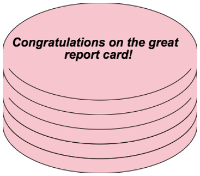

Ünite 2: Veri yapılarına giriş
===================================================
Öğrenciler veri yapılarına duyulan ihtiyacı keşfederler ve nasıl tanımlanacakları konusunda pratik yaparlar.

Gözden geçirme (Süre: 15 dakika)
--------------------------------

Önceki ünitede Önyükleme 1'de gördüğünüz hemen herşeyi gözden geçirdiniz: Veri tipleri, sözleşmeler, ve tasarım reçetesi. Nu ünitede bunların üzerine ve ötesine geçeceksiniz, ve Önyükleme 2'de yapacağınız herşeyin temelini oluşturan yeni bir veri tipi öğreneceksiniz.

Önceki ünitedeki konuların zihninizde taze olduğundan emin olmak için şu aktiviteyi yapın:

İşkitabınızın 8. sayfasına gidin. ``iki-kat-yarıçap`` isimli bir fonksiyon yazın, öyle ki bu fonksiyon girdi olarak bir yarıçap ve renk alsın. Sonra istenen renkte ve verilenin iki katı yarıçapa sahip çerçeve bir çember üretsin.

Tasarım reçetesini nasıl kullanacağınızı hatırlayın.

**Adım 1: Sözleşme ve amaç tanımı yazın**

* Fonksiyonun ismi ne? Nereden biliyorsunuz?
* Girdileri kaç tane?
* Girdi veri tipleri neler?
* Çıktısı nedir?
* Sizce bu fonksiyon ne işlem yapıyor? Bunun için iyi bi amaç tanımı ne olmalıdır?

    # double-radius : Number String -> Image

    # Makes an outlined circle that has twice the given radius.

**Adım 2: Örnekler**

Sadece Sözleşme ve amaç tanımını kullanarak aşağıdaki soruları cevaplamaya çalışın

* Her örnek fonksiyon ismiyle başlar. Fonksiyonun ismini nerede bulacaksınız?
* Her örnek bazı girdiler içeir. Bu fonksiyonun kaç girdisi olacağını, ve onların veri tiplerini nereden bulacaksınız?
* Her örnek fonksiyonun bu girdilerle üretmesi gereken ifadeyi içerir. Bu fonksiyonun ne yapacağını anlamak için neye bakmalısınız?
* Kağıda iki örnek yazın, sonra örnekler arasında değişen kısımları daire içine alarak işaretleyin. İşaretlerken bu değişen şeylerin neyi temsil ettiğini düşünün.

``examples:`` ve  ``end`` satırlarını koymayı unutmayın! Örnekler kısmının şuna benzer görünmeli::

    examples:
        iki-kat-yarıçap(50, "pink") is circle(50 * 2, "outline", "pink")
        iki-kat-yarıçap(918, "orange") is circle(918 * 2, "outline", "orange")
    end
    
**Adım 3: Fonksiyon tanımı**

Örnekler arasında değişenin ne olduğunu belirledikten sonra değişmeyen herşeyi kopyalayın, değişenlerin yerine ise seçtiğiniz değişken isimlerini koyun. ``fun`` ve ``end`` anahtar kelimelerini koymayı unutmayın::

    # iki-kat-yarıçap: Sayı, Metin -> Resim
    # Verilenin iki katı yarıçapa sahip çember çizer
    fun iki-kat-yarıçap(radius, color):
        circle(radius * 2, "solid", color)
    end

Daha fazla pratik için işkitabınızın 9. sayfasında gidin ve ``iki-kat-genişlik`` fonksiyonu için tasarım reçetesini tamamlayın.

Veri Yapılarına Giriş (Süre: 30 dakika)
---------------------------------------

Bilgisayarınızda `Paraşüt Atlama`_ programını açın ve çalıştırın. Ne oluyor?

Paraşüt atlayıcı uçaktan atlar ve düz aşağıya, suya düşer. Ancak karaya inmek çok daha güvenli. Koda bakarak neden soya düştüğünü anlamaya çalışalım.

``sonraki-pozisyon`` ismiyle tanımlanan fonksiyona bir bakın.

* Fonksiyonun girdi ve çıktı alanı nedir?
* `sonraki-pozisyon` fonksiyonu girdileriyle ne yapıyor?

Bu fonksiyon atlayıcının x ve y koordinatlarını temsil eden iki sayı alır, ancak sadece y koordinatını 5 çıkartarak değiştirip geri döndürür. Ama sadece y koordinatı değişiyorsa atlayıcı her zaman düz aşağıya düşecek ve suya inecektir. Karaya ulaşması için diyagonal (çağraz) düşmesi lazım. Bunu nasıl yapabiliriz.

Atlayıcı sağa doğru çapraz düşüyorsa x koordinatı nasıl değişmeli? Y koordinatı nasıl değişmeli?

Fonksiyonlar sadece bir değer geri döndürebilir, ama bizim hem x hem de y koordinatını döndürmemiz lazım ki atlayıcıyı çapraz hareket ettirebilelim. Çok süşür ki birden fazla şeyi bir kabın içine koymamıza yarayan *Veri Yapısı* denilen bir yol var.

Bu etkinlik için Coord isimli bir veri yapısı ile çalışacağız. Bu yapı x ve y koordinatlarını temsil eden iki sayı içerebiliyor. Bu yapıları ``coord`` isimli bir fonksiyon kullanarak yaratacaksınız::

    # coord : Number Number -> Coord

 
Şİmdi paraşütçüyü kurtarmak bizim ellerimizde.

İşkitabınızın 10. sayfasına gidin, problemi okuyun, ``next-position`` isimli fonksiyon için sözleşme ve amaç tanımını yapın.

    # next-position : Number Number -> Coord
    # Given 2 numbers, make a Coord by adding 5 to x and subtracting 5 from y

Şimdi iki örnek bulmaya sıra geliyor.  ``next-position`` fonksiyonunu kullanmak kolay, ama bu sayılara ne olacak? İki sayıyı aynı anda döndürmek için veri yapısı kullanmalıyız. Bunun için oluşturucu fonksiyonu çağıracağız. 

* ``Coord`` tanımına göre hangi fonksiyon bir Coord oluşturur?
* ``coord(...)``
* Coord'un parçası olan iki şey nedir? İlk örneğimiz için bunlar ne olmalı?
* Coord'umuzun verilen sayıların aynısını içermesini istemeyiz, sayıları nasıl değiştirmeliyiz?
* İlk örneğiniz şuna benzer olmalı::

    examples:
       next-position(30, 250) is coord(30 + 5, 250 - 5)
    end
* İlk örnekten sonra farklı x ve y girdi değerleriyle bir tane daha örnek yapın.

Artık iki örneğimiz olduğuna göre fonksiyonu tanımlama zamanı geldi. Nasıl yapılacağını biliyporsunuz: iki örnek arasında değişen şeyleri çember içine alıp birer etiket koyun, değişmeyen şeyleri ise aynen kopyalayın ve değişen şeylerin olduğu yere seçtiğiniz değişken isimlerini koyun.

Şimdi bitirdiniz, fonksiyon tanımı şuna benzer görünmeli::  

	fun next-position(x, y):
	   coord(x + 5, y - 5)
	end
	 	

Şimdi sadece bir koordinatı (y koordinatı) değiştirip döndürmek yerine paraşütçünün hem x hem de y koordinatlarını bir veri yapısının içinde geri döndürebiliriz.

Şimdi `Paraşüt Atlama`_ programına tekrar gidin ve orijinal 'next-position' fonksiyonu yerine işkitabınızda yaptığınız paraşütçüyü güvenle indirecek olanı koyun.

Önyükleme 1'de bir fonksiyondan sadece bir şey geri döndürebiliyordunuz: bir sayı, metin, resim, veya mantıksal. Önyükleme 2'de fonksiyonlarımız hala bir şey geri döndürüyor, ama o şey içinde istediğiniz sayıda nesne barındıran bir *Veri Yapısı* olabiliyor. Böylece paraşütçünün hem x hem de y koordinatını bir Coord kullanarak döndürebiliyor, veya başka veri yapıları tanımlayıp paraşütçü hakkında sağlığı, konumu, teçhizatı gibi bilgileri de döndürebiliriz.

Pastalar  (Süre: 30 dakika)
---------------------------------------

Farzedelim ki ünlü bir pasta fırınının sahibisiniz. Kurabiye, pasta, turta gibi şeyle pişiriyorsunuz, ama özellikle kekleriniz ünlü. Kek nasıl bir şeydir? Metin? Sayı? Mantıksal? Bunların hiçbiri tek başına bir keki tarif etmeye yetmiyor. Ancak diyebiliriz ki bir kek hakkında önemli belirli özellikler vardır, ve bu özelliklerin herbiri bildiğimiz veri tiplerinden biriyle ifade edilebilir.

Aşağıdaki kek özelliklerinden herbiri için onu nasıl bir veritipiyle temsil edebileceğinizi düşünün:

* Kekin tat çeşidi. Mesela "çikolata", "çilek", "kırmızı kadife", veya başka birşey.
* Kekin rengi.
* Üstündeki yazı.
* Katların sayısı
* Dondurmalı olup olmadığı.

Peki tüm keki temsil etmek için nasıl bir veri tipi kullanabiliriz?

Şimdi kekin özelliklerinin herbiri ile ilgili veri tiplerini bildiğimize göre kekin kendisini temsil etmek için bir veri yapısı kullanabiliriz. Bunun nasıl olduğuna bir bakalım.

.. image:: images/unite2_pict_2.png
    :align: right

İşkitabınızın 11. sayfasını açın.

Sayfanın en üstünde kekin özelliklerinin neler olduğunu belirten bir yorum metni göreceksiniz. Altında ise `Cake:` diye başlayan bir satır. Bu satır `Cake' isimli yeni bir veri yapısının tanımının başlangıcıdır. Bir sonraki satırda bir Cake üreten bir fonksiyon (`cake`), ve sonra bir Cake'in nasıl yapılacağının kesin tarifini, yani Cake ver yapısındaki her şeye karşılık bir satır ve o şeyin veri tipini görüyoruz.

Cake veri yapısının ilk kısmı nedir? Onu temsil etmek için hangi veri tipini kullanabiliriz?

Veri yapılarının tanımlanması biraz yeni sözdizimi içeriyor. Sayfa 11'in ilk satırında `flavor :: String` yazmak istiyoruz, ki bu Pyret'a her Kek'in ilk elemanının onun çeşidi olduğunu ve bir metin ile temsil edildiğini ifade ediyor.

Kek'in diğer alanlarını (mesaj, katmanlar, dondurmalı) da listeleyin ve onları hangi veri tiplerinin temsil edeceğini not edin. Alanları virgülle ayırmayı unutmayın.

Kağıdınızda şuna benzer bir kod olmalı::

	# a Cake is a flavor, color, message, number of layers, and whether or not it is an ice cream cake.
	data Cake:
	  | cake(flavor :: String,
		  color :: String,
		message :: String,
		 layers :: Number,
	    is-iceCream :: Boolean)
	end

Bu Cake veri yapısını tanımlayan koddur. Bilgisayara bir kek'in ne olduğunu ve içinde nelerin yeraldığını söylüyor. Aynı zamanda onn için bir de `cake` isimli oluşturucu fonksiyon tanımlıyor. Bir Cake yapmak için oluşturucu fonksiyonu çağırmanız ve beş değer vermniz gerekiyor:  `çeşit/flavor`, bir Metin, `renk/color`, bir Metin, `mesaj/message`, başka bir Metin, `katmanlar/layers`, bir Sayı, ve `dondurmalı-mı/is-iceCream`, bir Mantıksal. Unutmayın ki sıralamanın önemi var! Şimdilik, bunlar bir kekle ilgili takip edeceğimiz şeyler, ama haya edebilirsiniz ki başka bilgiler de eklenebilir.

_Fırıncı dosyasını açın ve 3-10 satırlar arasını inceleyin. Kayıtta yazdığınız ile örtüşüyor mu?

Şimdi biraz daha alt kısmını inceleyin, satır 12: : `cake2 = cake("Chocolate", "brown", "Happy birthday!", 8, false)`

* Bu değişkenin ismi ne?
* `cake2`'nin çeşidi ne?
* Rengi ne?
* Mesajı ne?
* Kaç katmanı var?
* Dondurmalı mı?

`cake5` isimli yeni bir kek tanımlayın. Başlangıç olarak:

* Bu değişkeni nasıl tanımlarsınız?
* Bir Cake yapmak için hangi fonksiyon kullanılır?
* Bir Cake yapısındaki ilk gelen şey nedir?

Şimdi etkileşim alanına `cake5` yazdığınızda ne olmasını beklersiniz? Çaşıştır'a basın ve deneyin::

	cake5 = cake("Peanut Butter", "brown", "Congratulations!", 2, true)

Siz de iki tane en sevdiğiniz bazı keklere karşılık değişken tanımlayın. Onlara `cake6` ve `cake7` diyebilirsiniz, veya istediğiniz ismi takın. İstediğiniz çeşit kek yapabilirsiniz, yeter ki veri yapısı parçaları için gereken şeylere uygun veri tipleri ile beslensin.

Şu ana kadar iki farklı veri tipi ile çalıştınız: Coords ve Cakes, ve bunların farklı örneklerini oluşturdunuz.Bu ders boyunca tanımladığınız veri yapılarından çok daha fazla sayıda onların örneklerini oluşturacaksınız.  Şimdilik önemli olan nokta bir veri yapısı tanımlama ile (`data ...` diye yazılan kod kısmı) o yapının örneklerini oluşturma (mesela `cake1` veya `coord(44, 75)`).

Cakes yapısının yarattığınız örneklerini düşünürseniz:

* Bir Cake oluşturan fonksiyonun adı nedir?
* Bu fonksiyonun girdi alanı nedir?
* Bu alanda kaç girdi değişkeni var.

`cake` fonksiyonunun girdi alanındaki beş şey, esasen sayfa 11'de zaten listelediğimiz şeyler. Veri yapıları sözkonusu olduğunda şeylerin sırası önemlidir: `¢ake`'e verilen ilk şeyin Kek'in çeşidi, ilk sayının da onun katman sayısı olması gerekiyor.

Run butonuna bastıktan sonra, etkileşimler penceresine `cake1` yazın ve enter'a basın. Geriye ne döndürüyor?

Bu anlamlı mı? Etkileşimler alanına sadece bir sayı girerseniz ne oluyor? Aynı sayıyı geri döndürüyor. Peki metin, res,m, veya mantıksal girince? Ever girdiye hiçbirşey yapmıyorsak, veya üzerinde bir fonksiyon çalıştırmıyorsak, ne verdiysek onu geri alıyoruz. Burada bir Cake verdiniz, ve aynı Cake'i geri aldınız!

Cake'lerinizin nasıl göründüğüne dosyanın alt kısmında verilen fonksiyonu kullanarak bakabilirsiniz. Bu fonksiyonun adı `draw-cake`, ve girdi olarak bir Cake alıyor, çıktı olarak onun görünüşünü veriyor.

Etkileşimler peneresinde `draw-cake(cake1)` yazın ve ne olduğuna bakın. Bu fonksiyonu tanımladığınız Cake'ler için kullanın.

Nokta-Erişimi (Süre: 10 dakika)
---------------------------------

Diyelim ki cake4'ün çeşit bilgisini ALMAK istedik. Mesaj, renk, veya diğer özellikleri umursamıyor, sadece çeşit bilgisini istiyoruz. Pyret'in bunu yapmak için bir sözdizimi var, bu da `.flavor` şeklinde.

Eğer etkileşimler penceresine `cake4.flavor` girerseniz bu ifade neye değerlenecektir? Deneyin.

* Ne tür birşey geri döndürdü: Sayı, Metin, Resim, Mantıksal, veya veri yapısı?
* `.flavor` kullanarak tanımladığınız bütün cake'lerin çeşit bilgisini almayı deneyin.

Elbette bir Cake'in tüm bilgisine erişmenin yolu var, sadec e`.flavor` değil. Etkileşim alanına `cake4.color` girerseniz ne döneceğini umuyorsunuz?

Tanımladığınız Cake'ler üzerinde `.color`, `.message`, `.layers`, ve `.is-iceCream` nokta-erişimlerini kullanmayı deneyin. Beklediğiniz gibi çalışıyor mu?

Bu sözdizimine Nokta-Erişimi diyoruz. Bu erişimler size ber yapının tam olarak hangi parçasını istediğinizi ifade etme imkanı verir.  Eğer bir Cake'in belirli bir kapıdan sığıp sığmayacağını bilmek istiyorsak muhtemelen sadece kaç katlı olduğunu bilmemiz yeterli olur. Benzer şekilde eğer oyunumuzdaki bir karakterin ölüp ölmediğini bilmek istiyorsak sadece karakterin `sağlık` 'ının 0'dan küüçük olup olmadığına bakmamız yeter, nerede olduğuna veya rengine bakmamız gerekmez. Programcılar karmaşık bir veri yapısının sadece belirli bir parçasını bilmek istediklerinde nokta-erişimi kullanırlar.

Bizim Cake yapımız Cake `data`sı ve `cake(...)` satırından oluşuyor. Bunlar da bilgisayara yapıyı nelerin oluşturduğunu ve herbir bileşenin sıra ve tipini belirtiyor. Buna karşılık olarak kullanabileceğimiz yeni fonksiyonlar elde ediyoruz. Bu iki satırı yazana kadar elimizde bir Cake yapacak `cake(...)` fonksiyonu, Cake'in çeşidini öğrenecek `.flavor` nokta erişimcisi, vb. yok. çünkü henüz Cake'i tanımlamamış olacağız.

Bunu kendiniz de denemek isterseniz `cake(...)` diye başlayan satırın başına bir \# koyun. Bu o satırı yoruma dönüştürür böylece bilgisayar o satırı görmezden gelir. Run'a basın ve ne olduğunu görün.

Kapanış (Süre: 5 dakika)
-------------------------

Veri Yapıları bir bilgisayar programında karmaşık verileri ifade etmek için çok güçlü bir  imkandır. Pong gibi basit bilgisayar oyunları sadece birkaç sayının takibini yaparak çalışabilir. Ama bir oyunda birden fazla karakter, tehlike, vb. ve bunların herbirinin kendi pozisyonu ve sağlığı takip ediliyorsa oyun son derece komplike olabilir. Bu durumda veri yapıları bu karmaşıklığı yönetmenin ve veriyi anlamlandırmanın önemli bir yoludur. Programcılar veri yapılarıyla çok şey yapabilirler, ve siz de gelecek derslerde kendi oyununuz için kendi veri yapılarınızı tanımlayacaksınız.
