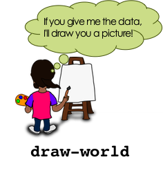

Ünite 4: Dünyaya Hoşgeldiniz
===============================

 Öğrenciler big-bang kullanarak program yazmak, 'sonraki-dünya' ve 'dünya-çiz' fonksiyonları içerisinde kod-yürüyüşü yaparak olay-tabanlı programlama konusunda deneyim kazanırlar. Daha sonra bu fonksiyonları geliştirip sonuçları ile denemeler yaparak veri yapılarına neden ihtiyaç duyulduğuna ilişkin bir kavrayış geliştirirler. 

Gözden Geçirme: Sizin Fırın (Süre: 10 dakika)
----------------------------------------------

Önceki bölümde pastalarla ilgili Cake veri yapısı üzeründe çalıştık. Cake'ler bir çeşit, renk, mesaj, kat sayısı ve dondurmalı olup olmadığı bilgisini içeriyor.

Bu alanların herbiri için hangi veri tipini kullanıyoruz?

Daha sonra, Cake yapısını tanımladıktan sonra, her Cake ile ilgili daha fazla bilgi, mesela şeker rengi, eklemek istersek ne olacak? Neyse ki Pyret ile çalışırken veri tipimizi değiştirmek çok kolay.

* Bu yeni bilgiyi içermesi için pastalar için olan veri yapısını nasıl değiştirmeliyiz?
* cake oluşturucusunun yeni ne değişkene ihtiyacı var? Veri tipi nedir?
* cake tanımını değiştirin, öyle ki bu yeni bilgiyi içersin.

Önemli! Herhangi bir veri yapısını değiştirdiğinizde, onun bütün örnekleri değişmeyecektir. Şu an için cake1, cake2, cake3 için yaptığımız tanımlar sadece dört bilgiyle yapıldı-onlara şeker rengi bilgisini eklemeliyiz.

cake1, cake2, cake3 tanımlarını değiştirin, öyle ki yeni Cake yapısıyla uyumlu olsunlar.

Hollywood Kuralı (Süre: 30 dakika)
-----------------------------------

Şimdi animasyonlardan bahsedeceğiz. Önce sadece sayılar kullanan çok basit bir örnekle başlayacağız, daha sonra yavaş yavaş veri yapıları oluşturacağız. 

`Big Bang'e Giriş`_ programını açın ve partnerinizle beraber inceleyin. Aşağıdaki soruları cevaplayabilir misiniz?

* 7-19 satırlar birçok değer tanımlıyor. Bunların isimleri nelerdir?
* Bunlar Sayı mı ,Metin mi, Resim mi?
* Dosyanın daha aşağısında iki fonksiyon tanımlanıyor. Bunların isimleri neler?
* Kodun "GRAPHICS FUNCTIONS" yazan kısmına inin (satır 22).
* Bu bölümde tanımlanan fonksiyonun ismi nedir?
* Fonksiyonun girdi alanı nedir? Çıktı alanı?
* Amaç ifadesine göre bu fonksiyon ne yapıyor?

`draw-world` fonksiyonu her çalıştığında geriye köpeğin arkaplan resminin üzerinde belirli bir noktada durur halini döndürüyor. Şimdi `draw-world`ün içeriğine bakalım. Belki de hatırlayacağınız, `put-image` isimli bir resim alan, sonra onu başka bir resmin x ve y koordinatlarına yerleştiren bir fonksiyonu kullanıyor. Bu örnekte DOG'u BACKGROUND'un üzerine yerleştiriyor. Dikkat ederseniz köpeğin y koordinatı için 400, ve x koordinatı için de `current-world` değişkenini kullanıyor. `current-world` değişkeninin değeri değişirken köpek te ekranda hareket ediyor görünüyor. Bu değer artarsa köpek sağa doğru gidecek, azalırsa sola doğru.

.. image:: images/unite4_pict_3.png
    :align: right

* Kodun aşağısına  "UPDATING FUNCTIONS"yazan yere gidin (satır 32)
* Burada tanımlanan kodun adı nedir?
* Girdi alanı nedir? Çıktısı nedir?
* Amaç ifadesine göre bu fonksiyon ne yapıyor?
* Bu fonksiyonun girdisi çıktısından daha büyük mü olacak, küçük mü?

`next-world` her çalıştırıldığında geriye girdisinden 10 fazla olan bir sayı döndürüyor.

`draw-world` sonraki dünyanın ne olacağını bilmiyor, ve `next-world` de bir dünyanın nasıl çizileceğini bilmiyor. Beraber çalışmaları gerekiyor ki animasyon akıcı olsun. Şimdi bunu gerçek dünyada oynayalım.

Bu aktivitede iki gönüllü, köpek resmi çıktısı ve biraz kağıt gerekiyor. Duvar bizim oyun ekranını temsil edecek, ve (0,0) sol alt köşe olacak. Bir gönüllü `draw-world` olacak. Onun işi resimleri duvara doğru yere koymak. Ona bir `current-world` (bir kağıda yazılı sayı) verildiğinde köpeği duvara (current-world,0) noktasına yapıştıracak. `next-world`ün farklı bir işi var: bir `current-world` verildiğinde, kağıda yeni bir dünya yazacaklar, ve bu verilenden 10 büyük olacak.

Bu noktada animasyonu yapmak için bütün gereksinimler tamam. 

* BACKGROUND-IMG, DOG-IMG, etc. animasyon için kullanabileceğimiz resimler.
* `draw-world` bir fonksiyon ve tek bir sayı alıp animasyonun bir anını çiziyor.
* `next-world` bir fonksiyon ve şimdiki dünyayı girdi olarak alıp bir sonraki dünyanın nasıl olacağını hesaplıyor.
* Ayrıca zamanın geçtiğini biliyoruz. Mesela her saniyede animasyonumuzun bir sonraki karesini görmek istiyoruz.

Şimdi tek eksiğimiz bunları beraber çalıştırıp animasyonu yapmak.

**Hollywood prensibi: "Siz bizi aramayın, biz sizi ararız!"**

Film dünyasında şöyle derler "Siz bizi aramayın, biz sizi ararız!" `next-world` ve `draw-world`ün birbiriyle savaşması sadece kaos yaratır. Bize bir yönetmen lazım ki herbirine ne zaman harekete geçeceklerini söylesin. Programlamada buna "Hollywood Prensibi" diyoruz ve programlarımızdaki animasyonları da aynen böyle yapacağız. Yönetmen'e `big-bang` adını verilmiş, ve onun işi zamanı geldiğinde her bir fonksiyonu çağırmak. Bu yüzden yaptığımız ilk şey big-bang' bir *ilk dünya* vermek. Ancak eğer yaptıklarımız bununla kalsaydı dünya hiç değişmeyecekti.

Yapmamız gereken şey big-bang'in birkaç saniyedebir `next-world` ü çağırmasını sağlamak. Big-bang `draw-world` ü ne zaman çağıracak? Dünyanın her yenilenişinde big-bang o yeni dünyayı çizmesi için draw-world'e verecek. O da köpeği arkapalan resminin üstüne yerleştirerek bu işi gerçekleştirecek.

Bilgisayarınızda satır 42ye gidin. Orada bazı yorum satırları ve big-bang'in kullanımına bir örnek var. Bu koda göre big-bang hangi ilk dünyayı girdi olarak alıyor? Run'a tıklayarak çalıştırmayı deneyin ve ne olduğunu görün.  Aynı canlandırmamızdaki gibi, big-bang hiç sıkılmadan şimdiki dünyayı sonsuza kadar gösterebilir. Ona numberA dışında bir sayı vermeyi deneyin ve ne olduğunu görün. Yapmamız gereken şey big-bang'e hangi **olay** ları dinlemesi gerektiğini, ve o olaylar gerçekleştiğinde hangi fonksiyonları çalıştırması gerektiğini söylemek.

.. image:: images/unite4_pict_4.png
    :align: right

Satır 49'u yorum olmaktan çıkartın: \# işaretini kaldırın. Şimdi artık big-bang her "tick" olayı (saatin tiktakı) olduğunda `next-world` ü şu anki dünyayı girdi olaral verip çalıştıracak. 

* Run'a basıp çalıştırınca ne olmasını beklersiniz?
* Deneyin, umduğunuz gibi oldu mu?
* Başka bir başlangıç dünyası kullansanız ne oluyor?
* next-world'ü 10 eklemek yerine 10 çıkartacak şekjilde değiştirseniz ne oluyor?

Şimdi satır 50'yi yorum olmaktan çıkartın. Bu satır big-bang'e zamanı geldiğinde dünyayı çizmek için kimi çağırması gerektiğini söylüyor.

* Şimdi Run'a basıp programı çalıştırsanız ne olmasını beklersiniz?
* Deneyin ve umduğunuz oluyor mu görün.
* Başka bir başlangıç dünyası kullansanız ne oluyor?
* draw-world'ü değiştirseniz ve DOG-IMG yerine COIN-IMG'i çizmesini sağlasanız ne olur?
* draw-world'ü current-world değişkenini x koordinatı olarak değil y koordinatı olarak kullanacak şekilde değiştirseniz ne olur?

Big-bang ve Hollywood Prensibi programlama dünyasında **Olay-Tabanlı Programlama** denilen programlama yaklaşımının bir parçasıdır. Olay-Tabanlı Programlama'da programınız "dünya" denilen bir kod parçasıdır, ki bu dünya belirli olaylar gerçekleştiğinde değişir.  Şimdiye kadar bildiğiniz olaylar tick olayları ve çizme olayları oldu, ama oyununuzda klavye ve fare olayları kullanarak başka fonksiyonlar yapabileceğinizi hayal edebilirsiniz. Ne var ki burada kullandığımız dünya sadece bir sayıdan ibaret. Peki ya animasyonumuzda hem Köpek hem de Para olsa ve farklı hızlarda hareket etseydi? O zaman dünya'mızın iki sayıdan oluşması gerekecekti. Bunu becerebilmek için Olay-Tabanlı Programlama'yı öğrenciğimiz başka bir kavramla birleştirmemiz gerekiyor.

Dünyayı Genişletmek (Süre: 45 dakika)
---------------------------------------

Eğer Köpek ve Para'nın bağımsız hareket etmesini istiyorsak sadece bir sayıdan fazlası olan bir dünyaya ihtiyacımız var. Tam olarak söylersek köpeğin x koordinatı ve paranın x koordinatını aayrı ayrı tutabilmeliyiz. Hem dogX hem de coinX değerlerini tutabilecek bir veri yapısına ihtiyacımız var. Şimdi dosyanın üst kısmına bir kod parçası ekleyelim ve hem dogX hem de coinX içeren bir dünya tanımlayalım. Aynı zamanda pratik olsun diye iki de dünya örneği yaratacağız::

	# The World is the x-coordinate of the dog and coin.
	data World:	
	  | world(
	      dogX  :: Number,
	      coinX :: Number
	      )
	end
	 
	# Two sample worlds
	worldA = world(0, 400)
	worldB = world(200, 1000)

Bunu programınıza girin, ve aşağıdaki soruları yanıtlayın:

* Bu kod bloğu ile yaratılan veri **tipi** nedir?
* Bir World yaratan **oluşturma fonksiyonu** nedir?
* Oluşturucu kaç girdi alıyor, tipleri nedir?
* worldA'nın veri tipi nedir?
* worldA'dan dogX'i nasıl alırsınız?
* worldB'den coinX'i nasıl alırsınız?
* worldC ve worldD diye iki yeni dünya tanımlayın.

Şimdi kodumuzun kalanını değiştirelim ki Sayılar yerine World'ler kullansın. Bu işe draw-world ile başlayalım. parayı resme eklemeden önce yeni veri yapımızı kullanmamıza rağmen köpeğin hala hareket ettiğinden emin olalım.

* Bu fonksiyonun ismi değişmeli mi? Peki ya girdi alanı ve çıktı alanı?
* Amaç ifadesi nasıl değiştirilmeli?
* Çıktı alanı diyor ki bir World döndürmek gerek. Hangi fonksiyon bir World oluşturur?
* world oluşturucu fonksiyonu ile bir yeni World oluşturun, öyle ki köpeğin x koordinatı 10 piksel sağda ve paranın x koordinatı da 5 piksel solda olsun::

	# next-world:  World -> World
	# Add 10 to the dog's x-coordinate, subtract 5 from the coin's x
	fun next-world(current-world):
	  world(current-world.dogX + 10,
		current-world.coinX - 5)
	end

Ve en son olarak ta big-bang'i bu yeni dünya veri yapısını kullanacak şekilde değiştirmeliyiz.

* big-bang'e verilen başlangıç değeri değişmeli mi?
* Tick olayı olduğunda hala next-world'ü mü çağırmalıyız?
* çizme olayı olduğunda hala draw-world'ü mü çağırmalıyız?
* Gerekli gördüğünüz değişiklikleri yapın ve Run'a basarak çalıştırın. Herşey yolunda giderse orijinal animasyonu, ancak yeni World veri yapısı kullanır halde görmelisiniz.
* Eğer big-bang'e verilen orijinal dünyayı değiştirirseniz ne olur? worldA, worldB, vb.'yi kullanmayı deneyin ve ne olduğunu görün.

.. image:: images/unite4_pict_5.png
    :align: right

Şimdi animasyonumuza başka resimler ekleme zamanı. Para'yı şimdilik bir tarafa koyarsak, pratik olsun diye bulut eklemeyi deneyelim.

put-image'ı CLOUD-IMG'yi BACKGROUND-IMG'nin üzerine (500,400) pozisyonuna yerleştirmek için nasıl kullnabilirsiniz?::

	# draw-world:  World -> Image
	# Place DOG-IMG and CLOUD-IMG onto BACKGROUND-IMG at the right coordinates
	fun draw-world(current-world):
	  put-image(
	    CLOUD-IMG,
	    500, 400,
	    put-image(
	      DOG-IMG,
	      current-world, 400,
	      BACKGROUND-IMG))
	end
 
Şimdi COIN-IMG'ı da ekleyin, bu kez (250, 300) posizyonuna.

Şimdi bulut ve para ekranda duruyor, köpek ise sağa doğru hareket ediyor. Ama paranın da hareket ettiğini görmnek istiyoruz, o yğzden işimiz bitmedi. Unutmayın ki current-world artık hem dogX hem de coinX içeriyor. Sadece para resmini yerleştirmek için coinX bilgisini kullanmamız yeterli.

draw-world kodunu değiştirin, öyle ki COIN-IMG resmi cırrent-world'den coinX'i kullanarak resme yerleştirilsin. Run'a bastığınızda köpeğin sağa, paranın da sola hareket ettiğini görmelisiniz. big-bang'e verilen ilk dünyayı değüiştirirseniz ne olur?

Diyelim ki kedinin x koordinatını da bu animasyona eklemeniz gerkti, ki o da sağa hareket etsin. World veri yapısında neyi değiştirmeniz gerekir? Peki ya draw-world ve next-world fonksiyonlarında? Diyelim ki kedinin aynı zamanda yukarı-aşağı da hareket etmesini istiyorsunuz, o zaman neyi değiştirirsiniz?

World veri yapısını kedinin x ve y koordinatını da içerecek şekilde değiştirin. Sonra da draw-world'ü değiştirip kediyi de resme eklemesini sağlayın. Not: Sonunda kedi klavye ile hareket ettirileceğinden ve kendi kendine hareket etmeyeceğinden şimdilik onu sabit bırakıyoruz.

next-world oyunumuzda kendi kendine, zamanın akışıyla hareket eden herşeyden sorumlu. Kedinin tuşlara basıldığında hareket etmesini istiyoruz, ki bu da başka bir olay türü. Bir sonraki derste dünyanın klavyeye basma olaylarına tepki vermesini sağlayacak fonbksiyonlar yazacaksınız.

Kapanış (Süre: 5 dakika)
--------------------------

Şimdi NinjaKedi oyununu temel taşlarına sahipsiniz, ve Pyret'ta draw-world, next-world ve big-bang'in nasıl birlikte çalışarak bir animasyon ortaya çıkardığını biliyorsunuz. Bir sonraki derste kedinin tuşlara tepki vermesini sağlayan yeni, bir olay türünü işin içine katacaksınız.
